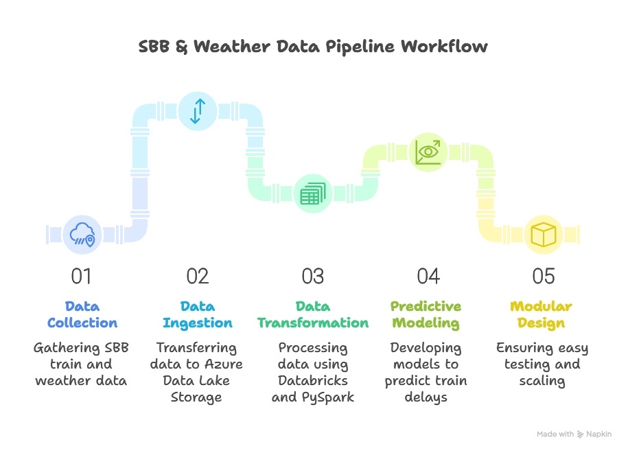

# SBB & Weather Data Pipeline - Zug, Switzerland

## Overview

This project collects and processes **SBB train data** for **Zug, Switzerland** along with **weather data**. The goal is to create a pipeline from **data ingestion to predictive modeling** using **Azure, ADLS, Databricks, PySpark, and MLflow**.

---

## Workflow

1. **Data Ingestion**
   - Retrieve SBB train data for Zug via API.
   - Retrieve weather data (snow, rain, temperature, etc.).
   - Store JSON files securely in **Azure Data Lake Storage (ADLS)**.

2. **Databricks Pipeline**
   - Load data from ADLS into Databricks.
   - Apply **Bronze → Silver → Gold** architecture:
     - **Bronze**: raw ingested files
     - **Silver**: cleaned and enriched datasets
     - **Gold**: aggregated tables for analytics and modeling

3. **Predictive Modeling**
   - Use **MLflow** to track experiments and predict **train delays** based on weather conditions.

4. **Future Enhancements**
   - Explore **Databricks GENIE** for automated feature engineering and model optimization.

---

## Key Technologies

- **Python**: data ingestion scripts  
- **Azure Data Lake Storage (ADLS)**: secure cloud storage  
- **Databricks / PySpark**: scalable ETL pipelines  
- **MLflow**: model tracking and experiment management  

---

> Modular design: ingestion, storage, processing, and modeling are separate steps for easy testing and scaling.
